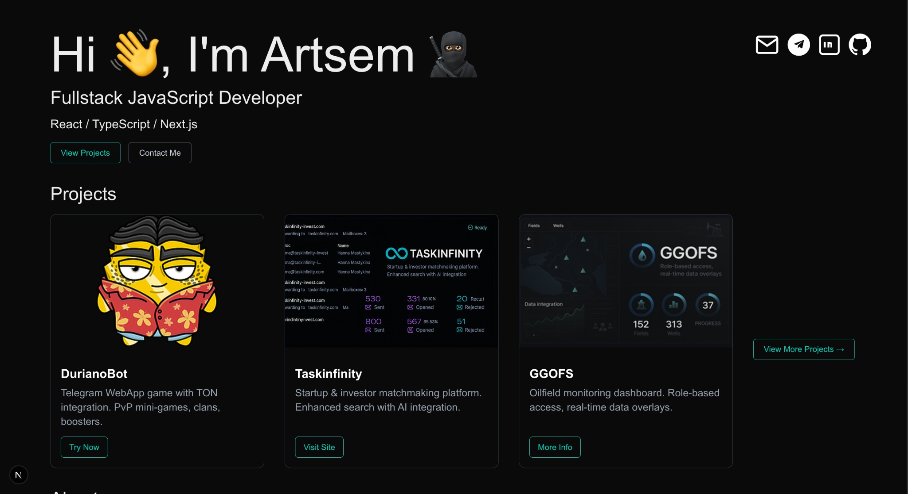

# 🧠 Artemische — Portfolio

Welcome to my personal portfolio built with **Next.js** and **Tailwind CSS**.  
It showcases selected projects I’ve built over the years — from Telegram apps to AI-powered platforms and automation tools.

---

## ✨ Tech Stack

- ⚛️ **Next.js 14** (App Router)
- 🎨 **Tailwind CSS** with dark theme
- 🔍 Fully responsive, mobile-first layout
- 🔗 Deployed on **Vercel**

## 🚀 Live Demo

[🔗 View Portfolio Website](https://your-vercel-link.vercel.app)

---

## 📸 Featured Projects

Each project card includes:
- 🧩 Tech stack used
- 🧠 Key features
- 🔥 Real-world use or deployment
- 📷 Custom visual preview

> _Some projects are under NDA — this portfolio includes only public cases._

---

## 📬 Contact Me

You can reach out via:
- [Telegram](https://t.me/DurianOG)
- [LinkedIn](https://www.linkedin.com/in/artsem-lisouski-ab987a210/)
- [GitHub](https://github.com/Artemische)
- [MailMe](mailto:lis.fox690@gmail.com)

---

## 🪄 License

This portfolio project is open-source and free to use for learning and inspiration.

---

_Designed and developed by **Artemische**